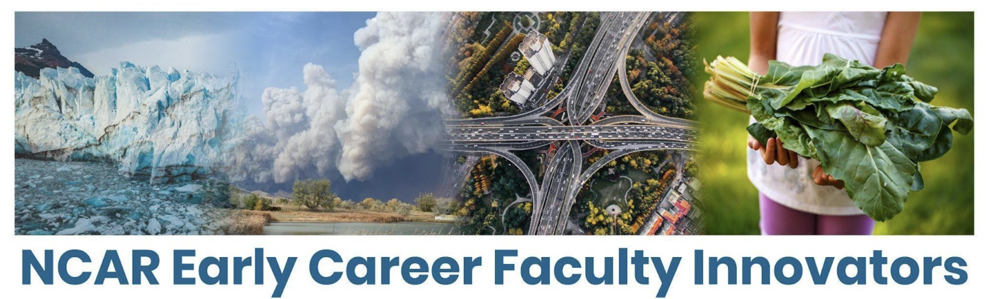

# [Climate Modeling Workshop](https://ncar.github.io/CESM-Tutorial-Innovator/README.html)

**Time**: Thursday August 3, 2023 (9:00-2:00 pm MT)

**Location**: FL1-2198-EOL-Atrium
___

___

### Planning committee
Melissa Moulton, Cecile Hannay, Isla Simpson, Brian Dobbins & Alexandra Ramos

### Purpose
What is a climate model? What is it like to run a climate model using high performance computing resources? How are figures generated from the model output and how are the results interpreted? What is “forced” climate variability versus “internal” climate variability? What are the limitations and sources of uncertainty in climate models? If you’ve been asking yourself any of these questions, this is a great hands-on opportunity to demystify climate modeling. If you already know some about climate models, this is an opportunity to dig a little deeper. The workshop will include brief lectures, hands-on practice with the Community Earth System Model (CESM) Large Ensemble (LENS2) via Jupyter notebooks on the cloud, and Q&A with climate, weather, and water scientists. No prior modeling or scientific computing/coding experience is required. Please bring a laptop with access to the internet and a web browser.

### Agenda

All times in MDT (GMT-6)

- 9:00 - 9:10 am		Welcome and Overview				
- 9:10 - 12:00 pm		Workshop
- 12:00 - 1:00 pm		Lunch
- 1:00 - 2:00 pm		Workshop 	

